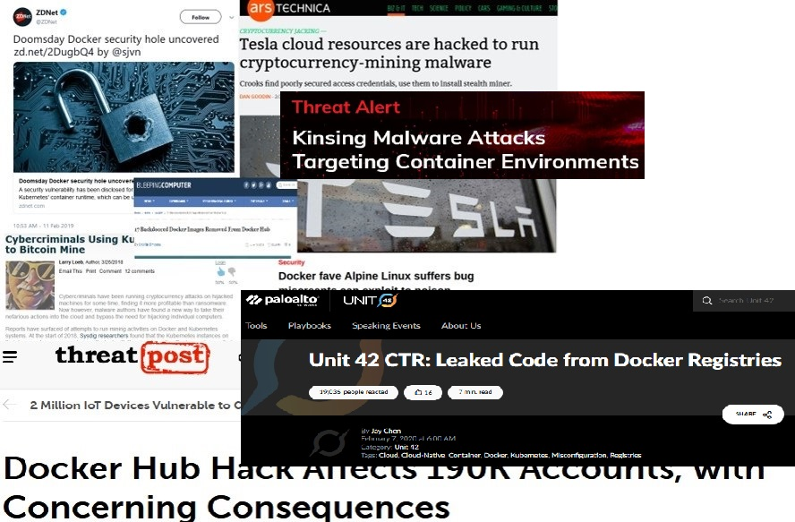

# README SDDOP

SecureDockerDevOpsPipeline (SDDOP) is a series of demos/walkthroughs on how to build and use Docker Containers in a safe, secure environment. 

While this series mostly focuses on DevOps automation, many of the Docker concepts and items used/explained here, also apply to any container and orchestration services at large, besides Docker and Kubernetes (K8S).

Docker containers these days are everywhere. From single Rasberry PIs to K8S Clusters as part of large corporate clouds. The amount of malware/vulernability discovered with Docker keeps on increasing at alarming speeds. The latest Docker malware, Kinsing, was just discovered earlier this week (03/05/20) and had been running for months! With modern cloud development, like statelesss services and containers running everywhere, due to contineously changing production environments as as result of orchestration services like K8S where containers might live for just a few seconds, it makes it increasing complex for organizations / blue teams to monitor and track vulnerabilities and exploits. 

As attackers/red teams are starting to beef up their game on Docker with distributions like CommandoVM and Kali, it is now even more important for Blue teams to start making sure that their Docker environments are being monitored correctly and are safe from these type of issues. 

## Intro Video

## SDDOP Demo 1: Install Docker and various SecurityTools onto Windows10-64bit 

- Time to run: Approx 20min
- Description: Shows how we (and attackers) can quickly can spin up Docker containers in seconds, even from a plain Win10 environment. 
- Pre-reqs: Plain Win10 64bit OS, with Powershell 5.1 (TLS1.2) enabled. Network access recommended.
- [Instructions](./docs/sddop_demo1_winconfig.md)

## SDDOP Demo 2: Running Clair VM inside Docker container to Scan other Docker images

- Time to run: Approx 10min
- Description: A vulnerabilty scan with the FOSS tool Clair, from CoreOS, shows that even popular Docker Images like NextCloud contain well known vulnerabilities.
- Pre-reqs: SDDOP package installed on Win10, or any other OS with latest version of Docker. Network access to DockerHub required
- [Instructions](./docs/sddop_demo2_clair.md)

### Docker Headlines

- 

### References

- [BoxStarter](https://boxstarter.org)
- [Chocolatey](https://chocolatey.org/docs/installation)
- [Windows Docker Machine](https://github.com/StefanScherer/windows-docker-machine)
- [CommandoVM](https://github.com/fireeye/commando-vm)
- [SANS Internet Storm Center](https://isc.sans.edu/forums/news/Docker+servers+targeted+by+new+Kinsing+malware+campaign/1314542/)
- [SecureDockerDevOpsPipeline (SDDOP)](https://github.com/stefanwinkel/sddop)
